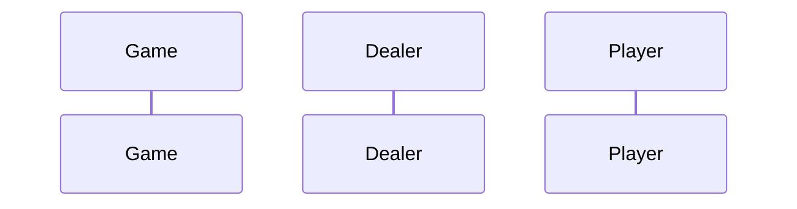

# Blackjack

## Program Specification _(Re-Written)_

Below is a re-write of the original program specification. The re-write consists of splictting up the paragraph into a game rhythm. The game rules are used to define the beginning, middle, and end states of the game and program, and within each state there are steps the program must take to go from state to state.

This project involves writing a program to simulate a blackjack card game. A simple console-based user interface was created to implement this game. An object-oriented solution was used for implementing this game.

### _Beginning_

1. A simple blackjack card game consists of a player and a dealer.
   - There is only one deck of cards.
2. A player is provided with a sum of money with which to play.
3. A player can place a bet between $0 and the amount of money the player has.
4. The dealer deals cards to itself and a player.
   - A player is dealt cards, called a hand.
   - Each card in the hand has a point value.
5. The objective of the game is to get as close to 21 points as possible without exceeding 21 points.
   - A player that goes over is out of the game.
   - The dealer must play by slightly different rules than a player, and the dealer does not place bets.

### _Middle_

7. A player is dealt two cards face up.
   - It is up to Player / Dealer to decide whether the value of an Ace is 1 or 11, based on the hands they have.
   - If the point total is exactly 21 the player wins immediately.
8. If the total is not 21, the dealer is dealt two cards, one face up and one face down.
9. A player then determines whether to ask the dealer for another card (called a “hit”) or to “stay” with his/her current hand.
   - A player may ask for several “hits.”
10. When a player decides to “stay” the dealer begins to play.
11. If the dealer has 21 it immediately wins the game. Otherwise, the dealer must take “hits” until the total points in its hand is 17 or over, at which point the dealer must “stay.”
12. If the dealer goes over 21 while taking “hits” the game is over and the player wins.
13. If the dealer’s points total exactly 21, the dealer wins immediately.

### _End_

14. When the dealer and player have finished playing their hands, the one with the highest point total is the winner.
15. Play is repeated until the player decides to quit or runs out of money to bet.

## Program Design

As written in the re-write version of the Program Specification, much of the thought went behind organizing the game into a set of beginning, during, and ending states, and stepping through the decisions the player and dealer must make to advance and/or end the game.

### Assumptions

- The Joker cards (2) are removed from the deck resulting in a standard 52-card playing deck.
- The "user interface" is mainly a set of Scanners seeking user input for each step of the game - no graphical user interface needs to be implemented in console

### Diagram

Below is a sequence diagram based on the re-write version of the program specification.

The diagram was built using [mermaid.js](https://mermaid-js.github.io/mermaid/#/), a markdown language for building Unified Modelling Language (UML) Diagrams, Entity Relationship Diagrams (ERDs), and more.

### Discussion

What is the current design approach?
There are several major chunks of the game that are needed to create a functional:

1. _Deck of Cards_: This is an object that stores the deck (52 cards), the standard/set values of the cards, and the adjustable value of the Ace. It will also store the methods for manipulating the deck, namely the use of the Random
2. _Random Deck Generator_: This is the functional component that is capable of generating a standard deck of cards in a random order for the start of the game. The output would be an an object described in the _Deck of Cards_.

What alternative design approaches were considered and why were they rejected?

## Implementation Code

The program was written in VSCode on WSL 2, Ubuntu 20.04.4 LTS. Please refer to [./src](./src) for code.

## Implementation Output

Below is an output in the VSCode Integrated Terminal.
