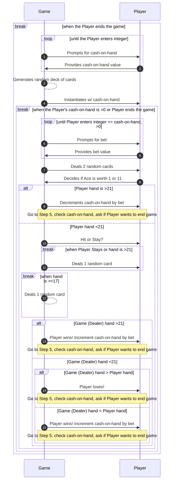
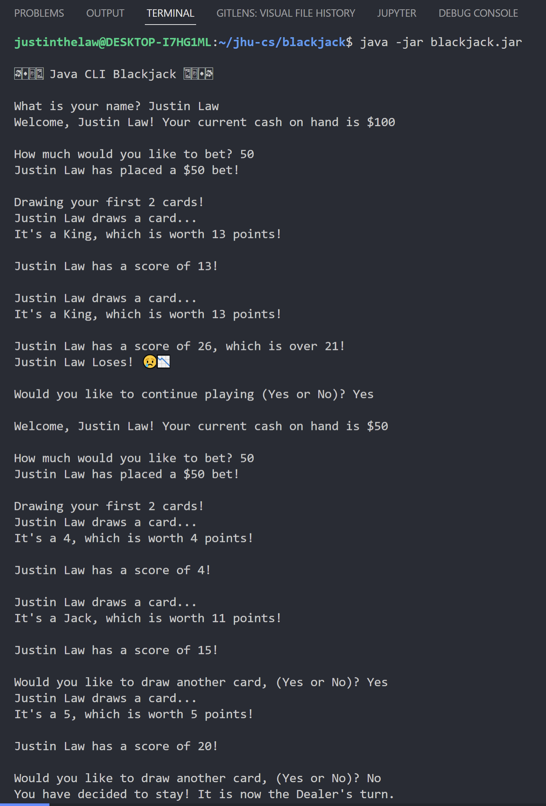
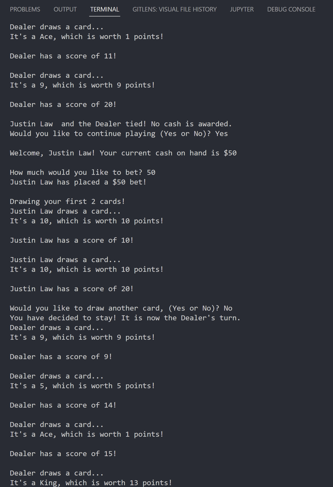
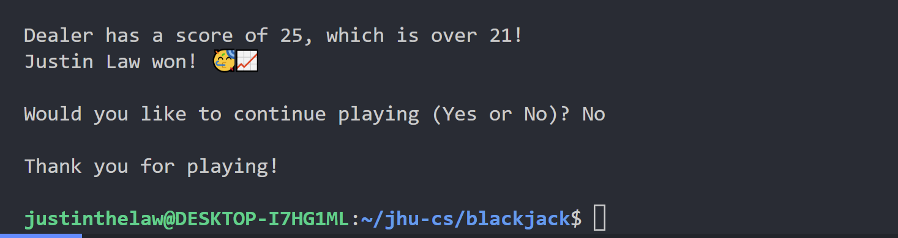
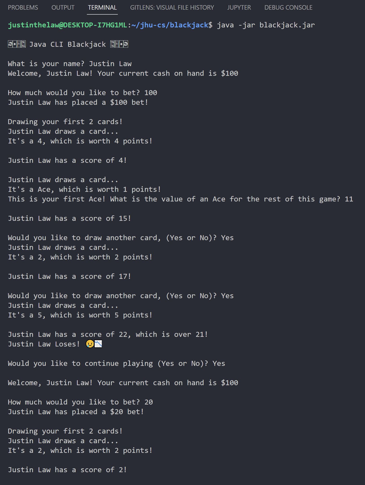
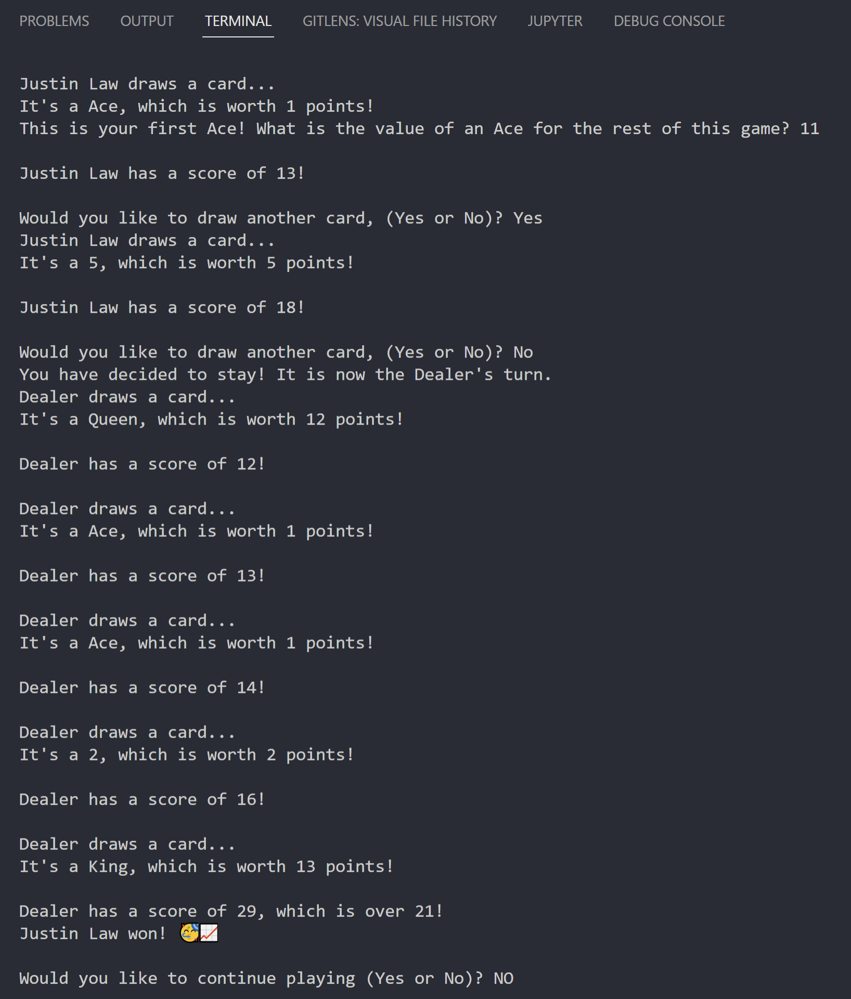

# Java Implementation

To run this program, either double-click on the jar file as an executable or execute `java -jar ${InsertYourDirectoryHere}/blackjack.jar` in your terminal. You will need a computer system with Java 7 or greater SE edition run-time and JDK.

You may optionally use a Java IDE for example NetBeans, Eclipse, VSCode (w/ Java extensions) etc.

## Program Specification

### 1. _Beginning_

1. A simple blackjack card game consists of a player and a dealer.
   - There is only one deck of cards.
2. A player is provided with a sum of money with which to play.
3. A player can place a bet between $0 and the amount of money the player has.
4. The dealer deals cards to itself and a player.
   - A player is dealt cards, called a hand.
   - Each card in the hand has a point value.
5. The objective of the game is to get as close to 21 points as possible without exceeding 21 points.
   - A player that goes over is out of the game.
   - The dealer must play by slightly different rules than a player, and the dealer does not place bets.

### 2. _Middle_

1. A player is dealt two cards face up.
   - It is up to Player / Dealer to decide whether the value of an Ace is 1 or 11, based on the hands they have.
   - If the point total is exactly 21 the player wins immediately.
2. If the total is not 21, the dealer is dealt two cards, one face up and one face down.
3. A player then determines whether to ask the dealer for another card (called a “hit”) or to “stay” with his/her current hand.
   - A player may ask for several “hits.”
4. When a player decides to “stay” the dealer begins to play.
5. If the dealer has 21 it immediately wins the game. Otherwise, the dealer must take “hits” until the total points in its hand is 17 or over, at which point the dealer must “stay.”
6. If the dealer goes over 21 while taking “hits” the game is over and the player wins.
7. If the dealer’s points total exactly 21, the dealer wins immediately.

### 3. _End_

1. When the dealer and player have finished playing their hands, the one with the highest point total is the winner.
2. Play is repeated until the player decides to quit or runs out of money to bet.

## Program Design

As written in the re-write version of the Program Specification, much of the thought went behind organizing the game into a set of beginning, during, and ending states, and stepping through the decisions the player and dealer must make to advance and/or end the game.

### Assumptions

- The Joker cards (2) are removed from the deck resulting in a standard 52-card playing deck
- The "user interface" is mainly a set of Scanners seeking user input for each step of the game - no graphical user interface needs to be implemented in console
- The dealer is not a playable participant, and the user may only take the Player role
- There is only 1 player (user) and 1 dealer in the game.
- User input error handling will only loop (ask the same question) until the user enters an acceptable response
- The suit of the card does not affect gameplay and thus does not need to be represented in the code or program
- The sum of money provided to the player is hard coded and can only be changed in the code

### Diagram

Below is a sequence diagram based on the re-write version of the program specification. A UML diagram was not built due to the low number of classes needed and the simplicity in class relationships relative to the complexity of the program execution's sequence of events.

The sequence diagram was built using [mermaid.js](https://mermaid-js.github.io/mermaid/#/), a markdown language for building Unified Modelling Language (UML) Diagrams, Entity Relationship Diagrams (ERDs), Sequence Diagrams and more.

The mermaid diagram below only builds in the VSCode previewer but not when it is live on Github. Please see [Blackjack-Diagram](Blackjack-Diagram.PNG) for the rendering of the diagram.

## Output

Below is an output in the VSCode Integrated Terminal.

### Program Run #1

---

### Program Run #2

