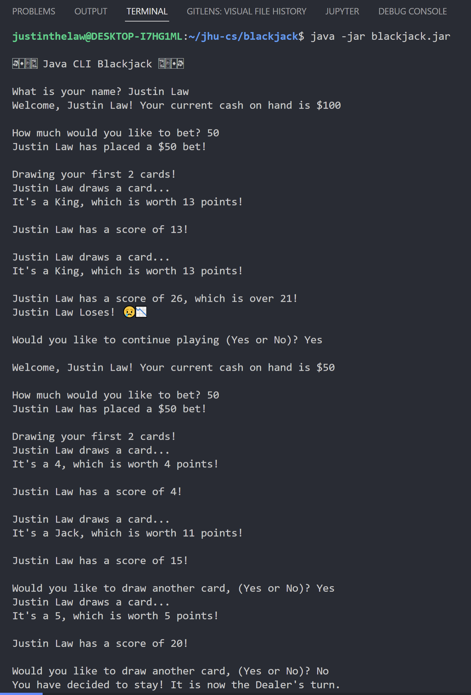
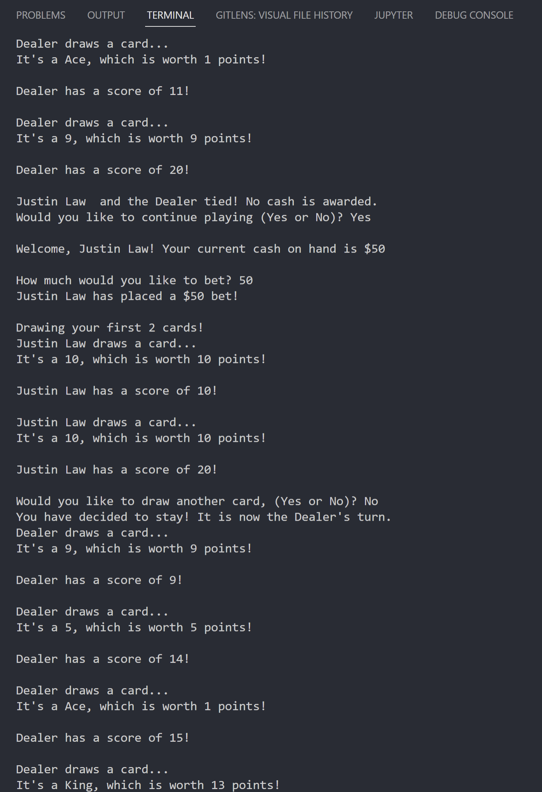
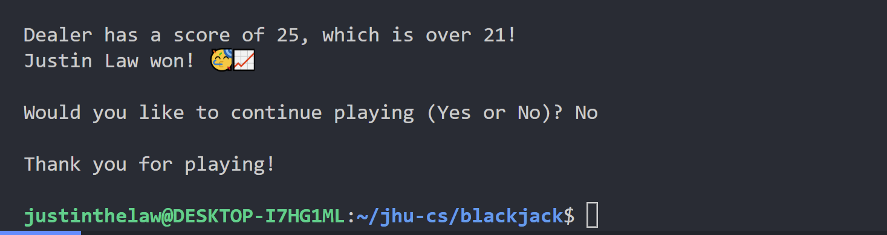
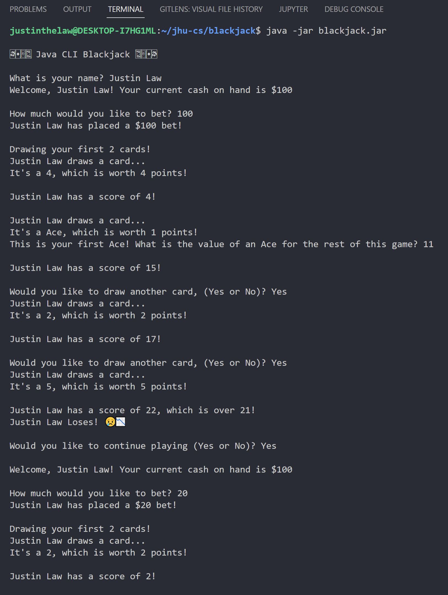
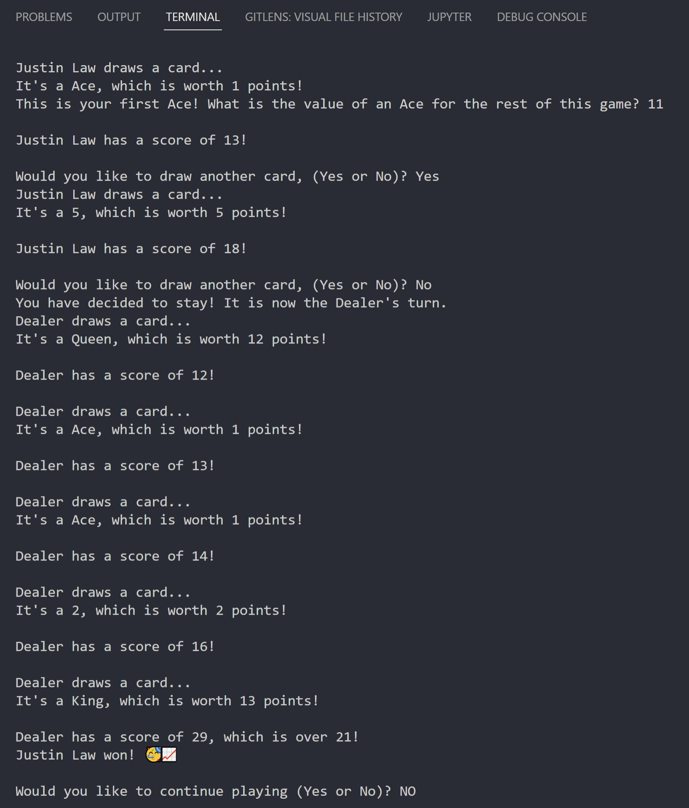

# Java Implementation

To run this program, either double-click on the jar file as an executable or execute `java -jar ${InsertYourDirectoryHere}/blackjack.jar` in your terminal. You will need a computer system with Java 7 or greater SE edition run-time and JDK. You may optionally use a Java IDE for example NetBeans, Eclipse, VSCode (w/ Java extensions) etc.

## Output

Below is an output in the VSCode Integrated Terminal.

Program Run #1

---

Program Run #2

